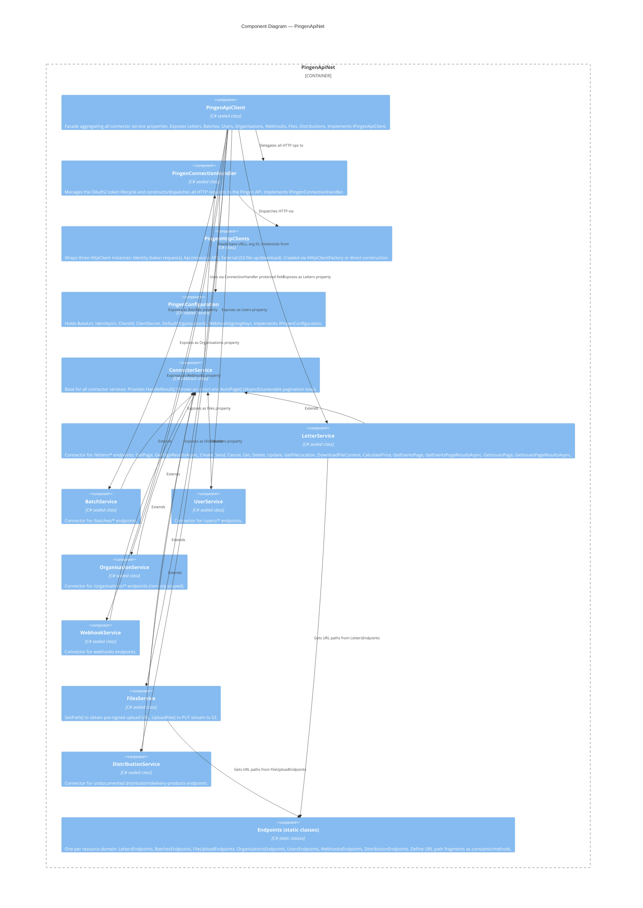

# C4 Level 3: PingenApiNet (Core Package)

`src/PingenApiNet/`

## Component Diagram

## Components in Detail

### PingenApiClient (`Services/PingenApiClient.cs`)

The consumer-facing entry point. Constructor-injected with all seven connector services and the connection handler. Exposes them as `IXxxService` properties. The only non-connector method is `SetOrganisationId(string)` which delegates to the connection handler to switch organisation context mid-session.

### PingenConnectionHandler (`Services/PingenConnectionHandler.cs`)

The most complex component. Responsibilities:
- Acquires and caches the OAuth2 bearer token (`SetOrUpdateAccessToken()` called before every request).
- Constructs `HttpRequestMessage` with correct URL (org-scoped or global), query parameters (paging, sorting, filtering, searching), and headers (`Idempotency-Key`).
- Detects which endpoints are NOT org-scoped (`NonOrganisationEndpoints` array: FileUpload, Users, Organisations root).
- Parses all rate-limit and request-ID response headers into `ApiResult`.
- Handles `302 Found` as success (file location endpoint).
- Exposes `SendExternalRequestAsync` for anonymous S3 requests.

Token field `_accessToken` is `static` — shared across all handler instances in the process (see [[decisions/002-static-access-token]]).

### PingenHttpClients (`Services/PingenHttpClients.cs`)

A thin wrapper grouping the three `HttpClient` instances. Created either via `IHttpClientFactory` (ASP.NET Core DI path) or `PingenHttpClients.Create(configuration)` (standalone path used by tests). The API client has `AllowAutoRedirect = false` (see [[decisions/004-three-http-clients]]).

### ConnectorService (`Services/Connectors/Base/ConnectorService.cs`)

Abstract base providing two reusable methods:
- `HandleResult<TData>(ApiResult<CollectionResult<TData>>)` — throws `PingenApiErrorException` on failure, returns `IList<TData>`.
- `HandleResult<TData>(ApiResult<SingleResult<TData>>)` — throws on failure, returns `TData?`.
- `AutoPage<TData>(apiPagingRequest, getPage)` — `protected async IAsyncEnumerable<IEnumerable<TData>>`. Loops from `PageNumber=1` (or caller's page) until `Meta.CurrentPage >= Meta.LastPage`.

### LetterService (`Services/Connectors/LetterService.cs`)

The most feature-rich connector. Key operations:
- `Create` — POST to `letters`, wraps `DataPost<LetterCreate, LetterCreateRelationships>`.
- `Send` — PATCH to `letters/{id}/send`, wraps `DataPatch<LetterSend>`.
- `GetFileLocation` — GET `letters/{id}/file`, returns `ApiResult` with `Location` URI (from `302 Found`).
- `DownloadFileContent` — calls `SendExternalRequestAsync` with the Location URI, parses XML error on failure.
- `CalculatePrice` — POST to `letters/price-calculator`.
- Events and Issues endpoints include a required `language` query parameter (appended directly in `LettersEndpoints`).

### Endpoints Static Classes (`Services/Connectors/Endpoints/`)

Each file is `internal static class`. Methods return `string` path fragments like `"letters/abc-123/send"`. These are concatenated by `PingenConnectionHandler` with the org-scoped prefix (`organisations/{orgId}/`) unless the path starts with one of the `NonOrganisationEndpoints`.
