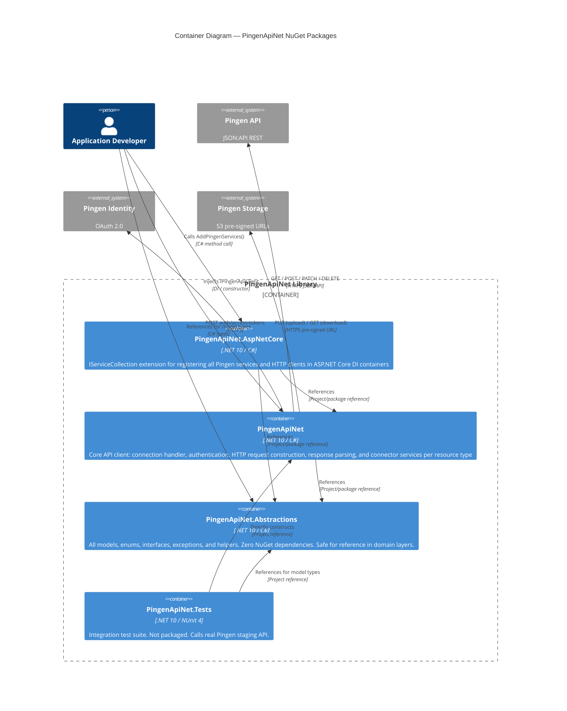

# C4 Level 2: Containers (NuGet Packages)

## Diagram

## Package Details

### PingenApiNet.Abstractions

| Property | Value |
|---|---|
| Repo path | `src/PingenApiNet.Abstractions/` |
| Namespace root | `PingenApiNet.Abstractions` |
| NuGet dependencies | None |
| Responsibility | All data contracts, domain interfaces, enums, custom JSON converters, helper utilities |
| Key interfaces | `IPingenConfiguration`, `IData`, `IAttributes`, `IRelationships`, `IDataResult`, `IDataPost`, `IDataPatch` |
| Key models | `ApiResult<T>`, `CollectionResult<T>`, `SingleResult<T>`, `Data<TAttributes>`, `DataPost<TAttributes>`, `DataPatch<TAttributes>` |
| Key helpers | `PingenSerialisationHelper`, `PingenWebhookHelper`, `PingenAttributesPropertyHelper<T>` |
| Exceptions | `PingenApiErrorException`, `PingenFileDownloadException`, `PingenWebhookValidationErrorException` |

### PingenApiNet

| Property | Value |
|---|---|
| Repo path | `src/PingenApiNet/` |
| Namespace root | `PingenApiNet` |
| NuGet dependencies | `Microsoft.Extensions.Http` 10.0.x |
| Responsibility | HTTP client management, OAuth 2.0 token lifecycle, URL construction, request dispatch, response parsing, connector services |
| Main entry points | `IPingenApiClient` / `PingenApiClient`, `IPingenConnectionHandler` / `PingenConnectionHandler` |
| Connector services | `LetterService`, `BatchService`, `UserService`, `OrganisationService`, `WebhookService`, `FilesService`, `DistributionService` |
| HTTP client factory | `PingenHttpClients` — wraps three `HttpClient` instances (Identity, Api, External/Files) |

### PingenApiNet.AspNetCore

| Property | Value |
|---|---|
| Repo path | `src/PingenApiNet.AspNetCore/` |
| Namespace root | `PingenApiNet.AspNetCore` |
| NuGet dependencies | `Microsoft.Extensions.DependencyInjection` 10.0.x |
| Responsibility | Single static class `PingenServiceCollection` with `AddPingenServices()` extension method. Registers all named HTTP clients and scoped services. |
| Consumer API | `services.AddPingenServices(configuration)` or `services.AddPingenServices(baseUri, identityUri, clientId, clientSecret, orgId)` |

### PingenApiNet.Tests (not packaged)

| Property | Value |
|---|---|
| Repo path | `src/PingenApiNet.Tests/` |
| Framework | NUnit 4, coverlet |
| Test type | Integration tests against Pingen staging API |
| Configuration | Environment variables (`PingenApiNet__BaseUri`, `PingenApiNet__IdentityUri`, `PingenApiNet__ClientId`, `PingenApiNet__ClientSecret`, `PingenApiNet__OrganisationId`) |
| Offline test | `Webhooks.DeserializeWebhookEventData` uses local `Assets/webhook_sample.json` |
| Test assets | `Assets/` — sample PDFs and a webhook JSON payload |
