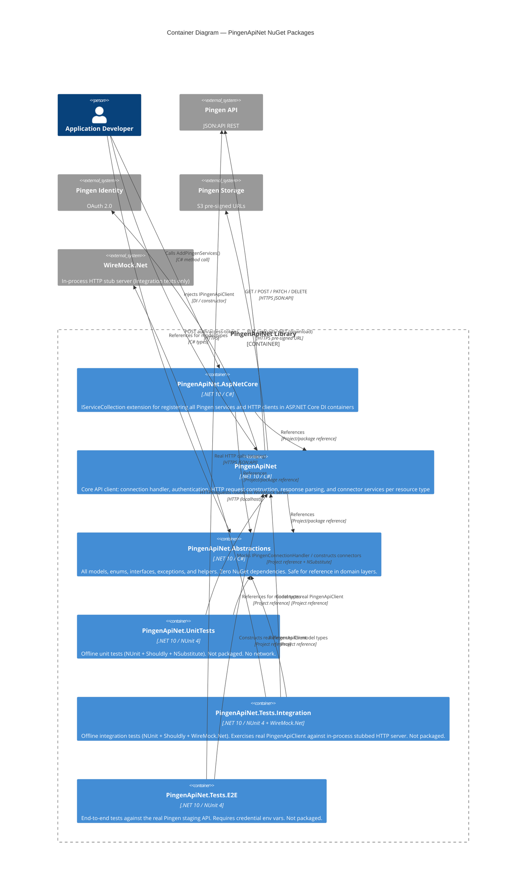

# C4 Level 2: Containers (NuGet Packages)

## Diagram

## Package Details

### PingenApiNet.Abstractions

| Property | Value |
|---|---|
| Repo path | `src/PingenApiNet.Abstractions/` |
| Namespace root | `PingenApiNet.Abstractions` |
| NuGet dependencies | None |
| Responsibility | All data contracts, domain interfaces, enums, custom JSON converters, helper utilities |
| Key interfaces | `IPingenConfiguration`, `IData`, `IAttributes`, `IRelationships`, `IDataResult`, `IDataPost`, `IDataPatch` |
| Key models | `ApiResult<T>`, `CollectionResult<T>`, `SingleResult<T>`, `Data<TAttributes>`, `DataPost<TAttributes>`, `DataPatch<TAttributes>` |
| Key helpers | `PingenSerialisationHelper`, `PingenWebhookHelper`, `PingenAttributesPropertyHelper<T>` |
| Exceptions | `PingenApiErrorException`, `PingenFileDownloadException`, `PingenWebhookValidationErrorException` |

### PingenApiNet

| Property | Value |
|---|---|
| Repo path | `src/PingenApiNet/` |
| Namespace root | `PingenApiNet` |
| NuGet dependencies | `Microsoft.Extensions.Http` 10.0.x |
| Responsibility | HTTP client management, OAuth 2.0 token lifecycle, URL construction, request dispatch, response parsing, connector services |
| Main entry points | `IPingenApiClient` / `PingenApiClient`, `IPingenConnectionHandler` / `PingenConnectionHandler` |
| Connector services | `LetterService`, `BatchService`, `UserService`, `OrganisationService`, `WebhookService`, `FilesService`, `DistributionService` |
| HTTP client factory | `PingenHttpClients` — wraps three `HttpClient` instances (Identity, Api, External/Files) |

### PingenApiNet.AspNetCore

| Property | Value |
|---|---|
| Repo path | `src/PingenApiNet.AspNetCore/` |
| Namespace root | `PingenApiNet.AspNetCore` |
| NuGet dependencies | `Microsoft.Extensions.DependencyInjection` 10.0.x |
| Responsibility | Single static class `PingenServiceCollection` with `AddPingenServices()` extension method. Registers all named HTTP clients and scoped services. |
| Consumer API | `services.AddPingenServices(configuration)` or `services.AddPingenServices(baseUri, identityUri, clientId, clientSecret, orgId)` |

### PingenApiNet.UnitTests (not packaged)

| Property | Value |
|---|---|
| Repo path | `tests/PingenApiNet.UnitTests/` |
| Framework | NUnit 4, Shouldly, NSubstitute, coverlet |
| Test type | Offline unit tests. No API credentials, no network. |
| References | `Abstractions` + `PingenApiNet` + `PingenApiNet.AspNetCore` |
| Test assets | `Assets/webhook_sample.json` — for offline deserialization tests |
| Test helpers | `Helpers/MockHttpMessageHandler.cs` — scriptable `HttpMessageHandler` stub used by `PingenConnectionHandler` unit tests |

### PingenApiNet.Tests.Integration (not packaged)

| Property | Value |
|---|---|
| Repo path | `tests/PingenApiNet.Tests.Integration/` |
| Framework | NUnit 4, Shouldly, **WireMock.Net 1.7.x**, coverlet |
| Test type | Offline integration tests. Each fixture spins up a local WireMock HTTP server, stubs the OAuth token endpoint + resource endpoints, and drives a real `PingenApiClient` whose three HTTP clients are rewired to the WireMock URL. |
| References | `Abstractions` + `PingenApiNet` only — does not depend on `AspNetCore` DI (constructs the client by hand). |
| Base | `IntegrationTestBase.cs` — `[OneTimeSetUp]` starts WireMock, `[SetUp]` resets stubs + stubs the token endpoint + creates a fresh `PingenApiClient`, `[TearDown]` disposes HTTP clients, `[OneTimeTearDown]` stops WireMock. |
| Helpers | `Helpers/JsonApiStubHelper.cs` — builds JSON:API `data`/`included`/`links`/`meta` response bodies, single + collection shapes, relationship wrappers, meta-abilities payloads. |
| Coverage | Per-connector round-trip tests: `BatchServiceTests`, `DistributionServiceTests`, `FilesServiceTests`, `LetterServiceTests`, `OrganisationServiceTests`, `PingenApiClientTests`, `UserServiceTests`, `WebhookServiceTests`. |

### PingenApiNet.Tests.E2E (not packaged)

| Property | Value |
|---|---|
| Repo path | `tests/PingenApiNet.Tests.E2E/` |
| Framework | NUnit 4, Shouldly, coverlet |
| Test type | Live end-to-end tests. Calls the real Pingen staging API. |
| References | `Abstractions` + `PingenApiNet` + `PingenApiNet.AspNetCore` |
| Required env vars | `PingenApiNet__BaseUri`, `PingenApiNet__IdentityUri`, `PingenApiNet__ClientId`, `PingenApiNet__ClientSecret`, `PingenApiNet__OrganisationId` (base class throws if any is missing). |
| Fixtures | `DistributionGetDeliveryProducts`, `FileUpload`, `LettersGetAll`, `RateLimit`. |
