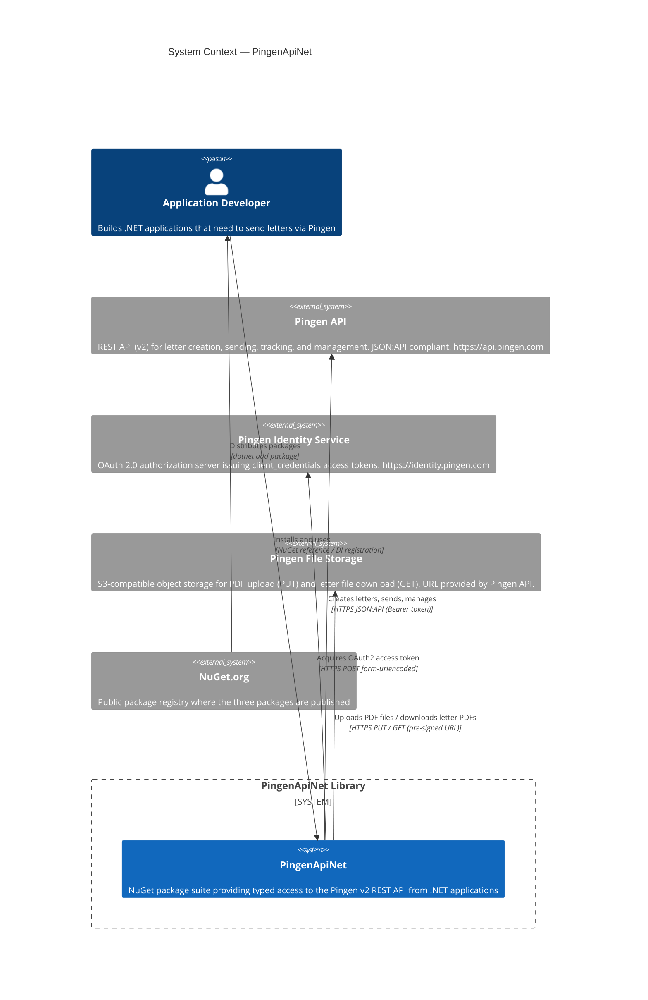

# C4 Level 1: System Context

## Diagram

## Actors

| Actor | Description |
|---|---|
| Application Developer | A .NET developer building an application (e.g., an ASP.NET Core web app or background service) that needs to send physical letters via Pingen. Installs the NuGet packages and calls the client API. |

## External Systems

| System | Purpose | Authentication |
|---|---|---|
| Pingen API | Core REST API for letter, batch, user, organisation, webhook, and distribution management. Base URL is configurable (production vs staging). | Bearer token (acquired from Identity Service) |
| Pingen Identity Service | OAuth 2.0 authorization server. Accepts `client_credentials` grant with `client_id` + `client_secret`. Returns a bearer access token with an expiry. | Client credentials (ID + Secret) |
| Pingen File Storage | S3-compatible object storage. Files are uploaded via HTTP PUT to a pre-signed URL (obtained from the API), and downloaded via HTTP GET from a redirect URL. | Pre-signed URL (no additional auth headers needed) |
| NuGet.org | Public NuGet registry where the three packages (`PingenApiNet`, `PingenApiNet.Abstractions`, `PingenApiNet.AspNetCore`) are published by the CI pipeline on git tag. | NuGet API key (CI secret) |

## Environments

Pingen provides two environments. Callers configure which to use via `BaseUri` and `IdentityUri` in `IPingenConfiguration`:

| Environment | Base URI | Identity URI |
|---|---|---|
| Staging | `https://api-staging.pingen.com` | `https://identity-staging.pingen.com` |
| Production | `https://api.pingen.com` | `https://identity.pingen.com` |
